# 🌌 Git-Aura

> Transform your GitHub activity into a unique, mathematically-derived piece of generative art.

<p align="center">
  
</p>

**Git-Aura** generates a beautiful, animated SVG visualization — your coding "aura" — based on your GitHub statistics. No more boring bar charts. This is art derived from math.

## ✨ Features

- 🎨 **Unique Visual Identity**: Each aura is deterministically generated from your GitHub user ID
- 🌈 **Language-Driven Colors**: Color palette derived from your top programming languages
- 🌀 **Particle Flow Field**: Organic curves using Simplex noise algorithms
- 💫 **Activity-Based Intensity**: Commit streaks influence the glow effect
- 🌙 **Dark Mode Ready**: Designed for GitHub's dark theme
- 🔄 **Daily Updates**: GitHub Action keeps your aura fresh

## 🚀 Quick Start

### Option 1: Fork & Use (Recommended)

1. **Fork this repository** to your GitHub account

2. **Enable GitHub Actions** in your forked repo (Settings → Actions → Enable)

3. **Run the workflow manually**:
   - Go to Actions → "Generate Git Aura"
   - Click "Run workflow"
   - Enter your GitHub username (or leave empty to use repo owner)

4. **Add to your profile README**:
   ```markdown
   
   ```

### Option 2: Run Locally

```bash
# Clone the repository
git clone https://github.com/ThanhNguyxn/git-aura.git
cd git-aura

# Install dependencies
pip install -r requirements.txt

# Set your GitHub token
export GITHUB_TOKEN="your_github_personal_access_token"

# Generate your aura
python main.py YOUR_GITHUB_USERNAME -o my-aura.svg
```

## 📖 How It Works

### The Math Behind Your Aura

Your GitHub activity is treated as a **feature vector** and transformed through mathematical functions:

| Metric | Transformation | Visual Effect |
|--------|---------------|---------------|
| Total Commits | $\rho = \log(commits)$ | Particle density |
| Max Streak | $I = \sigma(streak/365)$ | Glow intensity |
| Commit Times | $\chi = H(distribution)$ | Flow turbulence |
| Top Languages | Weighted RGB average | Color palette |

Where:
- $\sigma$ = Sigmoid function for smooth normalization
- $H$ = Shannon entropy for chaos measurement

### The Generative Engine

1. **Particle Initialization**: Fibonacci spiral distribution from center
2. **Flow Field**: Simplex noise creates organic vector forces
3. **Simulation**: Particles trace paths through the field
4. **Rendering**: Paths become SVG curves with glow effects

## ⚙️ Configuration

### CLI Options

```bash
python main.py [USERNAME] [OPTIONS]

Arguments:
  USERNAME              GitHub username (default: GITHUB_ACTOR env var)

Options:
  -o, --output PATH     Output SVG path (default: aura.svg)
  -w, --width PIXELS    SVG width (default: 800)
  -H, --height PIXELS   SVG height (default: 800)
  --no-animation        Disable CSS animation
  --check-changes       Only output if content changed
  -v, --verbose         Enable debug logging
```

### Environment Variables

| Variable | Required | Description |
|----------|----------|-------------|
| `GITHUB_TOKEN` | ✅ | Personal access token with `read:user` scope |
| `GITHUB_ACTOR` | ❌ | Default username (auto-set in Actions) |

## 🔧 GitHub Action Setup

The included workflow runs daily at midnight UTC. To customize:

```yaml
# .github/workflows/aura.yml
on:
  schedule:
    - cron: '0 0 * * *'  # Change schedule here
```

### Required Permissions

The workflow needs `contents: write` permission to commit the updated SVG.

### Preventing History Bloat

The workflow compares file hashes before committing — if your aura hasn't changed, no commit is made.

## 🎨 Customization Ideas

### Change Canvas Size

```bash
python main.py username -w 1200 -H 600  # Wide banner format
```

### Use in GitHub Profile

Add to your profile `README.md`:

```markdown
<div align="center">
  
  <p><i>My coding aura ✨</i></p>
</div>
```

## 📁 Project Structure

```
git-aura/
├── .github/workflows/
│   └── aura.yml              # Daily generation workflow
├── src/
│   ├── data_loader.py        # GitHub GraphQL API client
│   ├── generative_engine.py  # Particle system & noise
│   └── renderer.py           # SVG generation
├── main.py                   # Entry point
├── requirements.txt          # Python dependencies
└── aura.svg                  # Generated output
```

## 🛠️ Tech Stack

- **Python 3.11+**
- **NumPy** — Vector mathematics
- **svgwrite** — SVG generation
- **OpenSimplex** — Noise functions
- **requests** — GitHub API

## 📄 License

MIT License — feel free to fork, modify, and share!

## 🙏 Credits

Created by [@ThanhNguyxn](https://github.com/ThanhNguyxn)

Inspired by the beauty of mathematical visualization and the art of code.

---

<p align="center">
  <i>Your code has a soul. This is its aura.</i>
</p>
